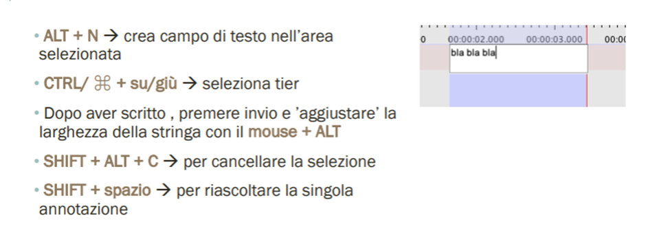

# La Trascrizione del Parlato con ELAN

## 1. Introduzione
L’obiettivo di questo workshop è quello di presentare anzitutto alcune nozioni di base in merito alla trascrizione e al sistema Jefferson (fornendo alcune possibili soluzioni ai problemi più comuni), per poi passare alle funzioni di base del software ELAN. In questo modo verranno forniti tutti gli strumenti per poter trascrivere un file audio in autonomia.

## 2. Trascrizione
Per trascrizione s'intende una forma di **rappresentazione del parlato in forma scritta**. Ciò può essere eseguito mediante diverse convenzioni, che vengono scelte in base agli obiettivi del ricercatore. Pertanto, prima di scegliere un tipo di convenzione piuttosto che un altro, è necessario tenere bene a mente il motivo stesso per cui stiamo trascrivendo. Vediamo quelli che sono gli obiettivi più comuni: 
1.	Si vuole studiare un fenomeno; 
2.	Si ha intenzione di documentare a livello più generale il comportamento di una comunità; 
3.	Si vuole avere una traccia scritta di “che cosa succede” nel mio file audio.

In base ai nostri obiettivi e a come decidiamo di usare il nostro programma, otterremo dei risultati diversi: 
1.	Un file annotato da consultare su ELAN;
2.	Testo da consultare senza riferimento audio;
3.	Trascrizione conversazionale;
4.	Testo glossato.
Il nostro focus sarà principalmente riguardo la trascrizione conversazionale e il sistema Jefferson.

### 2.1 Principali differenze fra scritto e parlato



Naturalmente, prima di iniziare la trascrizione bisogna tenere a mente alcune differenze sostanziali fra le produzioni in forma parlata e in forma scritta. Anzitutto, il fatto che il parlato venga organizzato in diretta fa sì che ci sia poco tempo per pianificare (ad esempio, possono esserci false partenze o progetti sintattici non portati a termine). Bisogna quindi capire come rappresentare questo tipo di caratteristiche. In più, la produzione e la ricezione sono contemporanee: pertanto, nel caso di compresenza di più parlanti all'interno di una registrazione, diverse produzioni in forma parlata possono sovrapporsi (e bisogna dunque trovare un modo per rappresentare anche questo tipo di situazioni).

### 2.2 Problemi più comuni
Uno dei problemi principali che emergono nella rappresentazione del parlato è **l'individuazione di unità**, ossia il corrispettivo in lingua parlata di ciò che rappresenta la frase nella lingua scritta.
Un altro problema che presenta il parlato è sicuramente **l'intonazione**: modulando l’intonazione possiamo cambiare il significato della frase che sto pronunciando (ad esempio, da essa dipende la distinzione fra una frase interrogativa e una frase dichiarativa). Bisogna dunque capire come trasferire queste informazioni nella trascrizione. 
Lo stesso vale per le pause, le false partenze, le riformulazioni, i cosiddetti filler e così via: vanno rappresentati nella conversazione? Se sì, come? Possono esserci diverse soluzioni a tale problema.

### 2.3 Possibili soluzioni
In realtà dipende la risposta dipende, in quanto bisogna sempre adattare le proprie risposte in base alle proprie esigenze di trascrizione. In base alle intenzioni con cui sto trascrivendo posso effettivamente decidere il sistema di trascrizione più adatto. Ad ogni modo, a prescindere dall'intento, bisogna sempre tenere a mente che bisogna cercare di tenere in equilibrio esigenze diverse: da un lato c’è la **fedeltà al parlato** (cercando di trascrivere anche aspetti come pause e sovrapposizioni fra parlanti), mentre dall’altro c’è la **cercabilità nel testo** (se sovraccarico il testo di simboli per indicare tutto ciò che avviene nel parlato, si rischia di perdere di cercabilità e di leggibilità). 
In sostanza, la trascrizione è una pratica di **decision-making**: in base al sistema di convenzioni che si sceglie di adottare, di volta in volta il trascrittore deve cercare di agire in maniera più coerente possibile rispetto al modello scelto e in base agli obiettivi che vogliamo raggiungere.

### 2.4 L’Individuazione di un’unità
Come è stato accennato precedentemente, una delle cose più complicate per quanto riguarda la trascrizione del parlato è l'individuazione dell'unità, cioè l'individuazione della frase. Ciò accade proprio perché il livello sintattico è quello che, rispetto allo scritto, presenta più differenze. A dire il vero, ai fini della trascrizione non è importante dare una definizione precisa di “frase” nel parlato: la trascrizione è uno strumento che ci serve a rappresentare il parlato, ma in un certo senso è pre-teorica, cioè non ci serve per l'analisi. La trascrizione deve essere sempre funzionale all'analisi, che avviene in un secondo momento. 
Per trascrivere, si è deciso di utilizzare come unità delle **unità di trascrizione** (che non hanno nessun tipo di rilevanza per l'analisi). L'unità di trascrizione viene individuata in base a un criterio intuitivo, cioè in base a parametri come la curva intonativa e, soprattutto, le pause. 

### 2.5 Cosa trascrivere?
Idealmente si trascrive quanto più possibile (ovviamente tenendo sempre a mente i nostri obiettivi). A volte, per alcuni tipi di trascrizione si trascrive anche ciò che fa il parlante (come ad esempio i suoi gesti). Normalmente trascriviamo anche le pause, i vari segnali discorsivi o le false partenze. Per quanto riguarda l’intonazione, abbiamo deciso di rappresentare nella trascrizione solo alcune curve intonative. Chiaramente, con una trascrizione più accurata vengono rappresentate più informazioni riguardo all’interazione che stiamo esaminando, ma in tal modo si perde la facilità con cui si può interrogare il testo.

### 2.6 Il Sistema Jefferson
Vediamo il sistema Jefferson, qui usato per la trascrizione. È sicuramente il **sistema di trascrizione più diffuso** (anche se non il migliore). Il sistema Jefferson permette una rappresentazione piuttosto dettagliata di molti dei fenomeni che occorrono nel parlato, tra cui:
- Sovrapposizioni, pause, interruzioni;
- Allungamenti delle vocali, alterazione del volume, alterazione della velocità del parlato;
- Comportamenti non verbali (come risate o starnuti).

 

Qui vediamo una lista dei simboli più usati nel sistema Jefferson. Bisogna però fare una precisazione: notiamo che nella lista è presente un simbolo per rappresentare una pausa breve, ma non una pausa lunga. Quest'ultima è assente nella lista poiché non viene rappresentata mediante un simbolo, ma si inseriscono direttamente due unità diverse (e quindi la pausa viene rappresentata dall'interruzione delle unità).

## 3. ELAN
**ELAN** è un **software gratuito**, la cui funzione principale è quella di permettere la **trascrizione del parlato**. Ad un livello più avanzato si può utilizzare anche per effettuare ricerche all'interno delle trascrizioni (interrogazione del corpus) e per creare annotazioni su più livelli (ad esempio, posso decidere di creare delle glosse). È uno dei software più diffusi per la trascrizione del parlato, per cui online sono reperibili molti strumenti di supporto accessibili gratuitamente. (INSERIRE LINK)

### 3.1 Scaricare il programma
Il programma è scaricabile a questo [link](https://archive.mpi.nl/tla/elan/download). Quando si scarica il programma, il sito stesso mette a disposizione molto materiale in PDF che si può utilizzare per prendere confidenza con ELAN o per risolvere moltissimi dei problemi che possono emergere con col programma. 

### 3.2 Scaricare i materiali
Nella cartella di Wetransfer da scaricare ci sono due file video e un file audio, per cui si può scegliere quello che si preferisce ai fini di questo esercizio di trascrizione.
1.	Il primo video è composto da una serie di estratti da uno dei dibattiti presidenziali tra Trump e Biden, pertanto è in inglese. Ovviamente ci sono tre partecipanti, cioè i due candidati e il moderatore. Uno dei vantaggi di questo file è che i due partecipanti sono inquadrati sempre, il che è utile in caso di sovrapposizioni (poiché vediamo “chi parla quando”).
2.	Il secondo video è un estratto di una puntata da Porta a Porta. Qui il dibattito è in italiano, ma ci sono ben cinque partecipanti. Inoltre, non sempre i parlanti sono inquadrati, per cui non sempre è facile capire chi sta parlando.
3.	Il file audio è un’intervista tratta dal corpus parlato. Ci sono solo due parlanti coinvolti, l'intervistato e l'intervistatore.

### 3.3 Qualità e Formato dell'Audio
Prima di andare avanti, è utile fare una premessa: la qualità della traccia audio, assieme ad altri fattori (come il numero di persone o il luogo in cui è stata registrata l'interazione), influisce molto sulla difficoltà della trascrizione. Per intervenire sulla qualità della traccia audio (ad esempio per alzare il volume o ridurre il disturbo) si possono usare moltissimi software, come ad esempio **Audacity** (scaricabile a questo [link](https://www.audacityteam.org/download/) gratuitamente).

Un altro aspetto che ha delle conseguenze sulla facilità della trascrizione è il formato della traccia audio.

Quando si usa un formato file non compresso, è possibile visualizzare le onde sonore del parlato. Ciò ci aiuta molto nell’individuazione delle unità, in quanto gli spazi vuoti tra un’unità e l’altra sono resi graficamente dall’assenza di onde sonore. Invece, nel caso di un file compresso non abbiamo alcuna rappresentazione visiva del parlato.

### 3.4 La Struttura di ELAN
La struttura di ELAN è costruita su righe diverse, che possiamo approssimare a uno spartito musicale per più strumenti: in sostanza, <ins>su ogni riga viene riportato ciò che dice un singolo parlante</ins>.

Questa è la visualizzazione che appare una volta aperto ELAN. Le righe qui riportate si chiamano **tier**: su ciascun tier (in questo caso ne sono presenti tre) bisogna trascrivere ciò che dice un singolo parlante. 

Vediamo un esempio:

In questo caso sono presenti quattro tier (Trump, Biden, il moderatore e il pubblico). Notiamo come gli applausi del pubblico siano contrassegnati dalle parentesi tonde doppie, in quanto con questo simbolo si indicano i comportamenti non verbali.

### 3.5 Aggiungere il file da trascrivere

Per avviare una trascrizione, la prima cosa da fare è associare il file audio o video che dobbiamo trascrivere, seguendo il percorso *File > New > Add media file*.
In generale, per tenere in ordine i file è prassi a dare al file della trascrizione lo stesso nome del file audio o video in modo tale che rimangano sempre associati e non si non si perdano.

### 3.6 Salvare un file

Ancor prima di iniziare la trascrizione è utile salvare il file quando è ancora vuoto. Fatto ciò, possiamo impostare il **backup automatico** (tramite il percorso *File > Automatic Backup*): è estremamente utile, in quanto così facendo non si perde il lavoro svolto nel caso in cui il software dovesse bloccarsi. Si consiglia di impostare il backup automatico con il minutaggio più basso possibile (quindi con un minuto).

### 3.7 Creazione dei Tier
A questo punto dobbiamo creare i Tier, affinché ciascuno di essi sia associato al parlante che vogliamo trascrivere.

Anziché creare un tier nuovo, possiamo modificare il tier che ELAN ci dà di default. Nella parte bassa della schermata troviamo una riga rossa col nome di “*tier default*”: possiamo semplicemente rinominare quel tier col nome che vogliamo associare a un certo parlante. Per farlo, clicchiamo col tasto destro sul tier default e selezioniamo “*Change Attributes of default*”; così facendo si apre una finestra nella quale è possibile modificare, tra le altre cose, il nome del tier.

A questo punto la cosa da fare è creare i tier successivi in base al numero di parlanti presenti nel file che vogliamo trascrivere. Se non sappiamo a priori quanti parlanti ci sono nel nostro file, possiamo tranquillamente aggiungere dei tier successivamente. Per aggiungere un nuovo tier basta andare sul pulsante “*Tier*” in alto e cliccare poi su “*Add New Tier*”: si aprirà dunque una finestra analoga a quella che abbiamo già visto, nella quale sarà possibile scegliere il nome del tier. 
Una cosa che spesso viene fatta è scegliere un codice alfanumerico per ogni tier, mentre nello spazio “participant” scriviamo il nome vero e proprio del partecipante (nel caso in cui non volessimo poi vederlo sulla trascrizione).

### 3.8 La Trascrizione e i Comandi Essenziali
A questo punto possiamo avviare la trascrizione vera e propria. 

Anzitutto bisogna precisare che tutti questi comandi qui riportati possono essere eseguiti anche col mouse. L’utilizzo della tastiera può risultare difficile all’inizio, in quanto bisogna memorizzare le diverse combinazioni di tasti per ogni specifico comando, ma risulta molto più vantaggiosa in seguito. 
Vediamo dunque alcuni dei comandi che servono per la trascrizione (tra i materiali c’è un PDF in cui c’è la lista completa delle combinazioni di tasti):
- **CTRL + Spazio**: avvia/stoppa la traccia audio.
- **CTRL/⌘ + K**: Seleziona/deseleziona la selection mode. Per individuare la stringa di parlato che vogliamo trascrivere bisogna entrare in selection mode, che può essere attivata o disattivata anche spuntando la casella apposita.
- **ALT + N**: A tal punto dobbiamo creare la nostra unità. Ciò significa che dobbiamo individuare quella che noi consideriamo essere un'unità di parlato che vogliamo trascrivere e selezionarla con la selection mode che abbiamo visto; dopodiché, una volta che abbiamo selezionato lo spazio che vogliamo trascrivere, dobbiamo <ins>creare una sorta di campo di testo all'interno di quello spazio selezionato</ins>, così che possiamo scriverci dentro quello che vogliamo. Per creare il campo di testo nello spazio selezionato, usiamo la combinazione ALT + N (oppure, una volta selezionato lo spazio, si può cliccare col tasto destro del mouse e premere su “New Annotation”). Premendo invio, l’unità trascritta si salva.
- **ALT + Mouse (in orizzontale)**: Volendo possiamo anche allargare o stringere la nostra unità con la combinazione ALT + mouse, premendo il tasto sinistro di quest'ultimo e spostando il cursore in senso orizzontale.
- **CTRL/⌘ + su/giù**: Questa combinazione serve per spostarsi da un tier all’altro in verticale (ad esempio, quando vogliamo trascrivere ciò che dice un parlante diverso da quello associato al tier su cui ci troviamo).
- **ALT + Mouse (in verticale)**: Può capitare di trascrivere le parole di un parlante nel tier sbagliato. Premendo ALT e il tasto destro del mouse, possiamo spostare l’unità da un tier all'altro (dunque in verticale). 
- **SHIFT + ALT + C**: Questa combinazione serve p34 cancellare una selezione, che + uno step necessario per poter cominciare una nuova selezione.
- **SHIFT + Spazio**: Questa combinazione serve nel caso in cui volessimo riascoltare la singola annotazione (ad esempio, può capitare che in un determinato punto l'audio non sia chiarissimo).

### 3.9 I Problemi più comuni
- **Cambiare le combinazioni di tasti**: In alcuni casi, le combinazioni di tasti precedentemente viste possono non funzionare, in quanto non tutte le tastiere funzionano allo stesso modo. In molti casi il problema può essere risolto svolgendo semplicemente l’azione col mouse, ma volendo ELAN offre anche l’opportunità di modificare le combinazioni di tasti associate a specifici comandi. Ad esempio, supponiamo che con la combinazione ALT + N io non riesca a creare il campo di testo nell’area selezionata: eseguendo il percorso *Edit > Preferences > Edit Shortcuts*, possiamo vedere quale combinazione di tasti è associata a quella specifica funzione ed eventualmente possiamo cambiarla a nostro piacimento.
  
- **Cambiare la velocità di riproduzione**: Se l’audio è troppo lento o troppo veloce, nella sezione in alto è possibile trovare il tasto “rate”, col quale si può modificare la velocità di riproduzione.
In alcuni casi la visualizzazione di ELAN è piccola. Per ingrandire solo la visualizzazione si può cliccare col tasto destro del mouse, selezionare “font size” e regolare la grandezza del testo. 
Un'altra cosa che può aiutare nella visualizzazione è il cursore in basso a destra, grazie al quale si può modificare la visualizzazione delle unità (restringendole o allargandole). Ciò vuol dire che la durata dell’unità si mantiene sull'asse temporale, ma diventa possibile visualizzare tutte le parole che prima non si riuscivano a vedere.
- **Ingrandire la visualizzazione delle unità**: In alcuni casi la visualizzazione di ELAN è piccola. Per ingrandire solo il corpo della trascrizione si può cliccare col tasto destro del mouse, selezionare “*font size*” e regolare la grandezza del testo. 
Un'altra cosa che può aiutare nella visualizzazione è il cursore in basso a destra, grazie al quale si può modificare la visualizzazione delle unità (restringendole o allargandole). Ciò vuol dire che la durata dell’unità si mantiene sull'asse temporale, ma diventa possibile visualizzare tutte le parole che prima non si riuscivano a vedere. In sostanza, con queste funzioni si alterà la modalità di visualizzazione delle unità, ma non le unità stesse.
- **Cancellare l'unità creata**: Per cancellare un'unità creata bisogna selezionarla cliccandoci sopra (in tal modo, l’unità dovrebbe diventare blu), per poi cliccare su “Delete Annotation”.
- **Il programma non legge il file mp3**: Tra i problemi che possono emergere durante la trascrizione, può capitare che ELAN non legga il file mp3 o che si blocchi. Il modo migliore per risolvere questo problema è cambiare il formato dell'audio, quindi convertirlo in formato .wav (è possibile farlo con Audacity, di cui abbiamo già parlato). Ovviamente, una volta cambiato il formato dell'audio bisogna riassociare nuovamente la trascrizione alla nuova traccia, e per fare ciò bisogna seguire questa sequenza: *Edit > Linked Files*.
